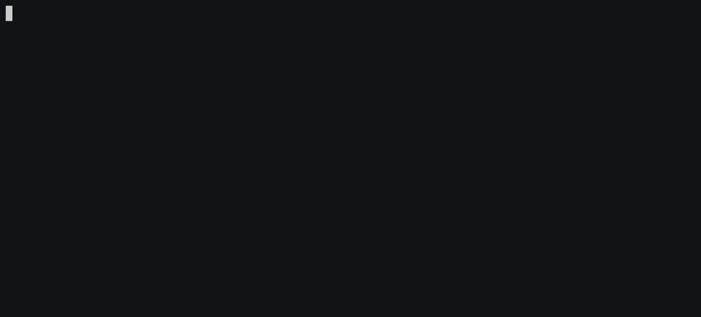
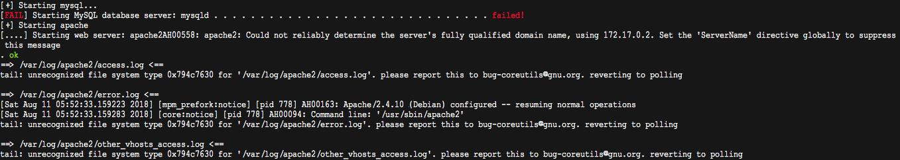
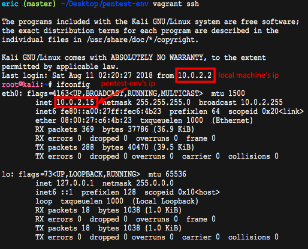
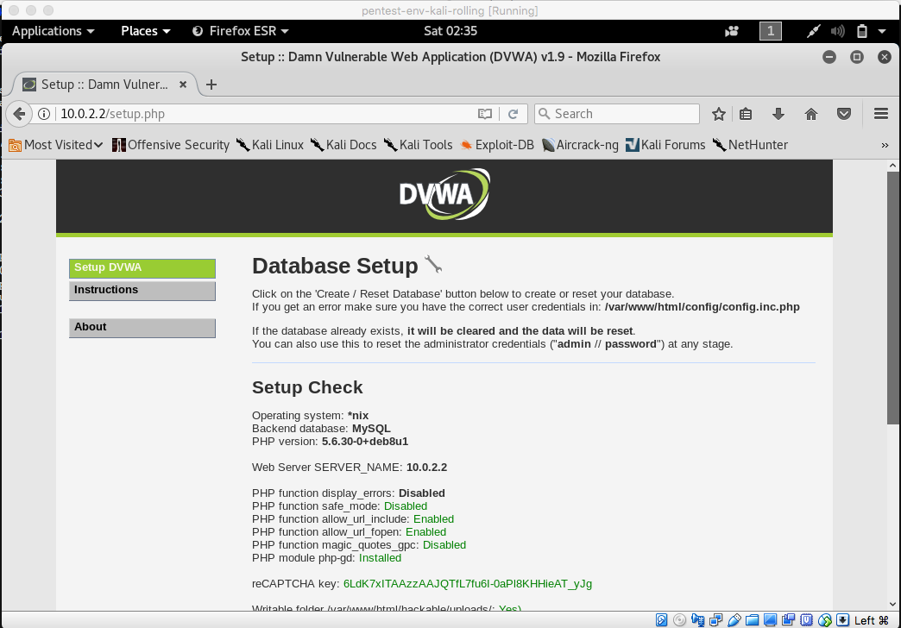
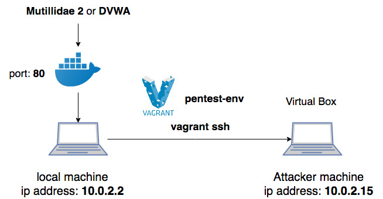

# Web Penetration Testing Learning Environment Setup Tutorial
In this tutorial, I will explain step by step guide to setup the environment to start your learning journey in web penetration testing. I tried to reduce the dependency of the setup as much as possible. But for your information, the setup was done in **MacOS**. So, if there is any steps that you discover that it will not work on your system, feel free to ask. If you have found a solution that works on your system, don't hesitate to share with me.

<!-- TOC -->

- [Web Penetration Testing Learning Environment Setup Tutorial](#web-penetration-testing-learning-environment-setup-tutorial)
    - [Requirements](#requirements)
    - [Environment Setup](#environment-setup)
        - [Installation of Mutillidae 2 using Docker](#installation-of-mutillidae-2-using-docker)
        - [Installation of DVWA using Docker](#installation-of-dvwa-using-docker)
        - [Setup Pentest-env using Vagrant](#setup-pentest-env-using-vagrant)
    - [Overall Diagram for the Testing Environment Setup](#overall-diagram-for-the-testing-environment-setup)

<!-- /TOC -->

## Requirements
* [Docker](https://www.docker.com/get-started)
* [Vagrant](https://www.vagrantup.com/downloads.html)
* [Mutillidae 2](https://sourceforge.net/projects/mutillidae/)
* [DVWA](http://www.dvwa.co.uk/)
* [Virtual Box](https://www.virtualbox.org/wiki/Downloads)
* [Git](https://git-scm.com/downloads)

## Environment Setup
In this tutorial, I will focus on two most popular web pentest application which are *Mutillidae 2* and *DVWA* (Damn Vulnerable Web App). There are numerous way to setup the Web Application for penetration testing exercise. In this tutorial, the method that I will be teaching is to setup the environment using <span style="color:green">docker</span> which acts as the <span style="color:green">victim's machine</span> and <span style="color:red">vagrant</span> to setup the <span style="color:red">attacker's machine</span>. You can also just install the DVWA and Mutillidae 2 and start to play with it without installing the pentest-env.
> **remember to start up your docker before following the installation guide below**

### Installation of Mutillidae 2 using Docker
To install Multillidae 2, you can follow the command in **command prompt** in Window or **terminal** in Linux or MacOS.
```
docker pull citizenstig/nowasp
```
This command will download the necessary files into your local machine. After that, you can run the Multillidae 2 in your local machine by running the command below.
```
docker run -d -p 80:80 citizenstig/nowasp
```
After inputing the command above, the victim's machine is started and run at port **80**. To start the exercise, simply visit http://localhost:80 through your browser.

To stop the victim's machine, just run the following command.
```
docker container stop <container_id>
```

> For more detail explanation, you can refer to this [page](https://hub.docker.com/r/citizenstig/nowasp/)

### Installation of DVWA using Docker
To install DVWA, you can follow the steps below using c**ommand prompt** in Window or **terminal** in Linux or MacOS
```
docker pull vulnerables/web-dvwa
```
To start the virtual machine, simply type the following command 
```
docker run --rm -it -p 80:80 vulnerables/web-dvwa
```
> If you get <span style="color:red">fail</span> to start the mysql server as shown below, please refer to this [page](https://github.com/ethicalhack3r/DVWA/issues/175) to fix the problem. 
> By the way, remember to **delete the image file downloaded** first before restarting the Docker by running 
> ```python
> docker image ls # to get the image id
> docker image rm <image id>
> ```
> After restarting the docker, you need to pull and run the container again as shown in the steps above.

Then the DVWA is started to run at port **80** in the localhost. To start the exercise, simple visit http://localhost:80 through your browser.

You will need to click the <span style="color:green">Create/Reset Database</span> button first to setup the database required for the exercise. The default credentials for the DVWA is `Username: admin` and `Password: password`.

To stop the container, simply type the command below
```
docker container stop <container_id>
```
> For more detail explanation about this docker, you can visit this [page](https://hub.docker.com/r/vulnerables/web-dvwa/).

### Setup Pentest-env using Vagrant
The virtual machine that will be used as the attacker's machine in this example is using [Kali Linux](https://www.kali.org/) which is a Linux distribution that built for penetration testing.

Before starting the guide, it is recommended that you clone the folder in the folder that can be access easily. In this tutorial, the location that I choose to clone the folder is **Desktop**. So, you need to change the directory to your desired folder before running the steps below. If you do not know how to change directory, you can search in [Google](https://www.google.com) using keywords like *change directory in command prompt* or *change directory in terminal*. 

After you are in your desired directory, you can start to follow the steps below.
```
git clone https://github.com/Sliim/pentest-env.git --recursive
```
This will clone the repository in your chosen directory and the folder name is **pentest-env**. Upon the cloning is done, you can type `cd pentest-env` to change the directory into the newly cloned repository.

Next, simply start the virtual machine by running
```
vagrant up
```
If you are running the command first time, it will start to download **box** for the virtual machine. This will take some time. After that, the next time you run the command, it will simply start the virtual machine. The credentials are `username: root` and `password: toor`.

After that, you can access the attacker's machine in your local machine using the command below.
```
vagrant ssh
```
This will start a ssh session from your local machine to the attacker machine. To access **Mutillidae 2** and **DVWA** in your local machine, you need to get the ip address of the local machine. The information can be obtained when your run the `vagrant ssh`. Below is a picture that shown when you can get the ip address.



Picture below shown that you can now access the victim's website through the attacker's machine.



> you can get more information about the pentest-env through this [page](https://github.com/Sliim/pentest-env)
> 
## Overall Diagram for the Testing Environment Setup



This diagram shown the overall diagram for the pentest environment setup which can help to visualize the environment after it had been setup successfully.